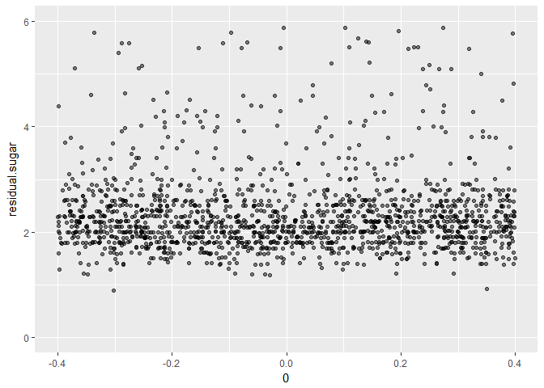
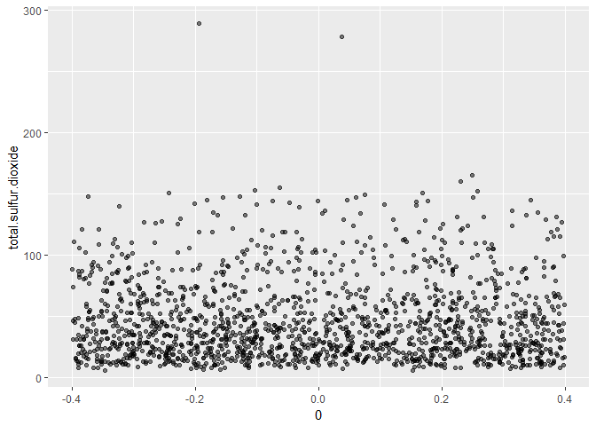

Red Wine Quality Insights by Toni Anev
======================================

Introduction
============

In this investigation I will use the "Wine Quality(Reds)" data set to explore and visualize relationships between to the observed variables. The set contains 1599 observations represented by 12 attributes comprising of 11 input variables and 1 output variable.

Through the use of Univariate, Bivariate and Multivariate analysis I aim to uncover noteworthy relationships and ultimately get a better understanding of what features have the most impact on perceived red wine quality.

Univariate Plots Section
========================

We begin our investigation by plotting each of the variables to get a general overview of the way the data is distributed and to see if there are any obvious similarities between variables.

    ##    Min. 1st Qu.  Median    Mean 3rd Qu.    Max. 
    ##    4.60    7.10    7.90    8.32    9.20   15.90

Looking at the fixed acidity histogram plot the data seems to be unimodal with a positive skew. We can see a median of x = 7.9 g/dm^3 coupled with a mean of x = 8.3 g/dm^3. Global minima and maxima points can be seen on the box and jitter plots at points y = 4.6 g/dm^3 and y = 15.9 g/dm^3 respectively.

    ##    Min. 1st Qu.  Median    Mean 3rd Qu.    Max. 
    ##  0.1200  0.3900  0.5200  0.5278  0.6400  1.5800

The volatile acidity histogram plot shows evidence of bimodality with a peak at x = 0.43 g/dm^3 and x = 0.6 g/dm^3. A median of 0.5 g/dm^3 and global minimum and maximum points at 0.1 g/dm^3 and 1.6 g/dm^3.

    ##    Min. 1st Qu.  Median    Mean 3rd Qu.    Max. 
    ##   0.000   0.090   0.260   0.271   0.420   1.000

Citric acid histogram exhibits some peculiar trends. We can observe large count spike at 0.02 g/dm^3 and 0.49 g/dm^3 and a global minimum and maximum at 0.00 g/dm^3 and 1.00 g/dm^3 respectively. A median of 0.26 g/dm^3 and mean value of 0.27 g/dm^3.

    ##    Min. 1st Qu.  Median    Mean 3rd Qu.    Max. 
    ##   0.900   1.900   2.200   2.539   2.600  15.500

The residual sugar plots show a fair amount of clustering in the sub 4 g/dm^3 range, with several outliers in the 9 g/dm^3 to 15.5 g/dm^3 range. A median of 2.2 g/dm^3 and mean of 2.5 g/dm^3 makes sense here as the sugar that is found in the wine grapes is usually converted to alcohol by the yeast during the winemaking process. It might be worth investigating the correlation between alcohol and residual sugar in wine to investigate this process.

Zooming in a bit on the jitter plot shows that indeed most wines tested are clustered around the 2 g/dm^3 range.

    ##    Min. 1st Qu.  Median    Mean 3rd Qu.    Max. 
    ## 0.01200 0.07000 0.07900 0.08747 0.09000 0.61100

The chlorides plot show an unimodal distribution with observations ranging from a global minimum at 0.01 g / dm^3 to a global maximum at 0.6 g / dm^3.

To get a closer look at the central tendency of the data the jitter plot is scaled to show data points between 0 and 0.2 g / dm^3. As expected from the summary calculation the graph shows a median value around 0.08 g / dm^3 and mean value of 0.09 g / dm^3.

    ##    Min. 1st Qu.  Median    Mean 3rd Qu.    Max. 
    ##    1.00    7.00   14.00   15.87   21.00   72.00

Sulfur dioxide is usually added to grapes as a preservative in order to prevent oxidation. The percentage of sulfur dioxide added to wine is relative to the quality of the grapes when they arrive to the winery with none added for healthy grapes to up to 72 mg/litre for grapes that have a higher degree of rot.

The plot show a positive skew with a median of 14 mg / dm^3 a mean of 15.9 mg / dm^3 and global minimum and maximum points at 1 mg / dm^3 and 72 mg / dm^3 respectively.

Total sulfur dioxide plots look relatively similar to the free sulfur dioxide plots above.

    ##    Min. 1st Qu.  Median    Mean 3rd Qu.    Max. 
    ##    6.00   22.00   38.00   46.47   62.00  289.00

Taking a closer look at the total sulfur dioxide plot we can see a relatively even distribution with a few outliers. Global minimum and maximum points are found at 6 mg / dm^3 and 289 mg / dm^3 respectively.

    ##    Min. 1st Qu.  Median    Mean 3rd Qu.    Max. 
    ##  0.9901  0.9956  0.9968  0.9967  0.9978  1.0037

The density plots show a narrow window of variation ranging from 0.99 g / cm^3 to 1.00 g / cm^3. The majority of wines seem to have a density of about 0.996 g / cm^3 which is slightly surprising that for the amount of variability in wine they all have nearly the same density.

    ##    Min. 1st Qu.  Median    Mean 3rd Qu.    Max. 
    ##   2.740   3.210   3.310   3.311   3.400   4.010

The pH data shows all of the tested wines are acidic with a fairly standard deviation from 2.7 pH to 4 pH. Additionally it seems that the majority of wines are around 3.3 pH.

    ##    Min. 1st Qu.  Median    Mean 3rd Qu.    Max. 
    ##  0.3300  0.5500  0.6200  0.6581  0.7300  2.0000

Looking at sulphates, as with the free and total sulfur dioxide plots we see an overall positive skew.

    ##    Min. 1st Qu.  Median    Mean 3rd Qu.    Max. 
    ##    8.40    9.50   10.20   10.42   11.10   14.90

The alcohol content of the sampled wines shows a fair amount of variance with the majority of wines hovering around 10 % alcohol / volume. It will be interesting to explore some of the relationships between sulphates and alcohol content and how that effects the final quality score of the wine.

The wine quality of the sample shows clustering around a score of 5 and 6 with minimum and maximum extremes found with scores of 3 and 8 respectively.

Univariate Analysis
===================

### What is the structure of your dataset?

Here is a closer look at the structure of the imported data set.

    ## 'data.frame':    1599 obs. of  13 variables:
    ##  $ fixed.acidity       : num  7.4 7.8 7.8 11.2 7.4 7.4 7.9 7.3 7.8 7.5 ...
    ##  $ volatile.acidity    : num  0.7 0.88 0.76 0.28 0.7 0.66 0.6 0.65 0.58 0.5 ...
    ##  $ citric.acid         : num  0 0 0.04 0.56 0 0 0.06 0 0.02 0.36 ...
    ##  $ residual.sugar      : num  1.9 2.6 2.3 1.9 1.9 1.8 1.6 1.2 2 6.1 ...
    ##  $ chlorides           : num  0.076 0.098 0.092 0.075 0.076 0.075 0.069 0.065 0.073 0.071 ...
    ##  $ free.sulfur.dioxide : num  11 25 15 17 11 13 15 15 9 17 ...
    ##  $ total.sulfur.dioxide: num  34 67 54 60 34 40 59 21 18 102 ...
    ##  $ density             : num  0.998 0.997 0.997 0.998 0.998 ...
    ##  $ pH                  : num  3.51 3.2 3.26 3.16 3.51 3.51 3.3 3.39 3.36 3.35 ...
    ##  $ sulphates           : num  0.56 0.68 0.65 0.58 0.56 0.56 0.46 0.47 0.57 0.8 ...
    ##  $ alcohol             : num  9.4 9.8 9.8 9.8 9.4 9.4 9.4 10 9.5 10.5 ...
    ##  $ quality             : int  5 5 5 6 5 5 5 7 7 5 ...
    ##  $ category            : Ord.factor w/ 4 levels "Terrible"<"Average"<..: 2 2 2 3 2 2 2 3 3 2 ...

### What is/are the main feature(s) of interest in your dataset?

Below is a look at a brief summary of the data contained in each variable.

    ##  fixed.acidity   volatile.acidity  citric.acid    residual.sugar  
    ##  Min.   : 4.60   Min.   :0.1200   Min.   :0.000   Min.   : 0.900  
    ##  1st Qu.: 7.10   1st Qu.:0.3900   1st Qu.:0.090   1st Qu.: 1.900  
    ##  Median : 7.90   Median :0.5200   Median :0.260   Median : 2.200  
    ##  Mean   : 8.32   Mean   :0.5278   Mean   :0.271   Mean   : 2.539  
    ##  3rd Qu.: 9.20   3rd Qu.:0.6400   3rd Qu.:0.420   3rd Qu.: 2.600  
    ##  Max.   :15.90   Max.   :1.5800   Max.   :1.000   Max.   :15.500  
    ##    chlorides       free.sulfur.dioxide total.sulfur.dioxide
    ##  Min.   :0.01200   Min.   : 1.00       Min.   :  6.00      
    ##  1st Qu.:0.07000   1st Qu.: 7.00       1st Qu.: 22.00      
    ##  Median :0.07900   Median :14.00       Median : 38.00      
    ##  Mean   :0.08747   Mean   :15.87       Mean   : 46.47      
    ##  3rd Qu.:0.09000   3rd Qu.:21.00       3rd Qu.: 62.00      
    ##  Max.   :0.61100   Max.   :72.00       Max.   :289.00      
    ##     density             pH          sulphates         alcohol     
    ##  Min.   :0.9901   Min.   :2.740   Min.   :0.3300   Min.   : 8.40  
    ##  1st Qu.:0.9956   1st Qu.:3.210   1st Qu.:0.5500   1st Qu.: 9.50  
    ##  Median :0.9968   Median :3.310   Median :0.6200   Median :10.20  
    ##  Mean   :0.9967   Mean   :3.311   Mean   :0.6581   Mean   :10.42  
    ##  3rd Qu.:0.9978   3rd Qu.:3.400   3rd Qu.:0.7300   3rd Qu.:11.10  
    ##  Max.   :1.0037   Max.   :4.010   Max.   :2.0000   Max.   :14.90  
    ##     quality           category  
    ##  Min.   :3.000   Terrible : 10  
    ##  1st Qu.:5.000   Average  :734  
    ##  Median :6.000   Good     :837  
    ##  Mean   :5.636   Excellent: 18  
    ##  3rd Qu.:6.000                  
    ##  Max.   :8.000

The main area of interest, and single output variable in this dataset, is the reported quality of each wine. All features contained about each sample inter-relate to produce a final quality score of the wine from 1 to 10.

### What other features in the dataset do you think will help support your

### investigation into your feature(s) of interest?

It will be interesting to investigate some of the characteristics inherent to each wine such as pH, density, sugar and alcohol content and to see how they impact the final quality score of each wine.

### Did you create any new variables from existing variables in the dataset?

I created an ordered variable 'category' which classifies the observed wines into four categories based on their quality scores.

### Of the features you investigated, were there any unusual distributions?
Did you perform any operations on the data to tidy, adjust, or change the form
of the data? If so, why did you do this?

I purposely tried not to tamper with the data too much yet as I felt it was important to visualize each of the variables naturally to get a more intuitive feel for the characteristics of each variable. I did "zoom in" to some of the jitter plots by scaling the x and/or y lim plot parameters in addition to adjusting the alpha of each plot point to 1/2 to decrease some of the clutter and better expose some of the trends within the plot.

It is worth noting that, residual sugar and chlorides features showed quite a large outlier count as compared to the other variables and may warrant further investigation.

Bivariate Plots Section
=======================

The correlation plot brings up several points of interest:

-   A strong negative correlation between pH and fixed acidity.
-   Strong positive correlations between citric acid and fixed acidity, total and free sulfur dioxide, density and fixed acidity.
-   Alcohol, sulphates, citric acid and volatile acidity are the strongest predictors of final perceived wine quality.

As confirmed by the jitter plot above wines with higher alcohol content have a tendency to be of higher quality.

Sulphate levels between 0.3 and 1 show substantial clustering around the 5 - 6 quality score. Some notable outliers show maximum near 2.

As expected there is an overall negative correlation between volatile acidity and quality of wine, with substantial clustering around 5 and 6 quality scores.

As predicted by the correlation plot we see an overall positive correlation between citric acid and quality of wine, however with much greater variability around each quality score cluster.

The correlation plot showed a surprisingly strong correlation between density and fixed acidity. Looking at the jitter plot above we can see that there is a prominent tendency for increase in fixed acidity as density increases, along with some prominent outliers.

Above we see the log10 residual sugar concentration against alcohol concentration. Given that alcohol found in wine is the result of yeast converting natural grape sugars into alcohol, I expected to see a stronger correlation between sugar and alcohol content. According to the data however there is a very narrow correlation between the two. It is worth noting that some preliminary research suggested that a good rule of thumb when buying wine is to use alcohol content as a predictor of wine's sweetness with anything less than 10% alcohol likely to be sweet.

Bivariate Analysis
==================

### Talk about some of the relationships you observed in this part of the
investigation. How did the feature(s) of interest vary with other features in
the dataset?

There were several points of interest when looking at bivariate relationship in the data:

1.  The strongest negative correlation of - 0.68 between fixed acidity and pH makes sense here as the more acidic a substance is the lower on the pH scale it will be.

2.  At + 0.67 we see correlations between:

<!-- -->

1.  Fixed acidity and citric acid which is somewhat surprising as fixed acidity is supposed to represent tartaric acid concentration.
2.  Fixed acidity and density which may warrant some further investigation as a correlation between the two is not immediately obvious.
3.  Total sulfur dioxide and free sulfur dioxide which makes sense as they both essentially look at SO2 concentrations.

<!-- -->

1.  Looking at correlations between quality we can see that alcohol and sulphates are strongly correlated at 0.48 and 0.25 respectively. Additionally, we can see that wines that have a higher volatile acidity tend to be of lower quality with a correlation of - 0.39. This too is to be expected as higher volatile acidity can lead to unpleasant vinegar taste in the wine.

2.  The variables most strongly correlated with red wine quality appear to be:

-   Alcohol
-   Volatile Acidity
-   Sulphates
-   Citric Acid

### Did you observe any interesting relationships between the other features
(not the main feature(s) of interest)?

One point of interest, aside from the main investigation into variables affecting quality, was the relationship between fixed acidity and density. There must be some factors that affect fixed acidity that are also somehow related to the density of a given wine.

Additionally, I expected to see a stronger correlation between residual sugar content and alcohol.

### What was the strongest relationship you found?

The strongest relationship is a -0.68 between pH and fixed acidity.

Multivariate Plots Section
==========================

Citric acid and fixed acidity showed a strong correlation. In terms of quality the correlation seems to be most prominent in average and good quality wines.

The more surprising correlation between fixed acidity and density again seems more prominent in the average to good categories of wine.

Looking at the relationship between fixed acidity and cube root of density separated out by each quality category seems to support the notion that the two variables share a strong positive correlation in each quality category.

Volatile acidity and pH showed a strong correlation but don't seem to have much impact on overall quality.

As the two strongest correlates to quality sulphates and alcohol show a fair amount of clustering.

Separating out the clusters by category again shows average and good categories exhibit clustering at the lower end of each axis.

Taking the log of sulphates and cube root of alcohol allows for a better visualization of each point.

    ## 
    ## Call:
    ## lm(formula = as.numeric(quality) ~ fixed.acidity + density, data = rwq)
    ## 
    ## Residuals:
    ##      Min       1Q   Median       3Q      Max 
    ## -2.88657 -0.54850 -0.03066  0.49550  2.55889 
    ## 
    ## Coefficients:
    ##                 Estimate Std. Error t value Pr(>|t|)    
    ## (Intercept)    200.52094   13.25989   15.12   <2e-16 ***
    ## fixed.acidity    0.20180    0.01451   13.91   <2e-16 ***
    ## density       -199.21191   13.38375  -14.88   <2e-16 ***
    ## ---
    ## Signif. codes:  0 '***' 0.001 '**' 0.01 '*' 0.05 '.' 0.1 ' ' 1
    ## 
    ## Residual standard error: 0.7514 on 1596 degrees of freedom
    ## Multiple R-squared:  0.1354, Adjusted R-squared:  0.1343 
    ## F-statistic:   125 on 2 and 1596 DF,  p-value: < 2.2e-16

Looking at the r-squared value for fixed acidity and density as predictors together as predictors of quality however shows a weak ~ 14% correlation.

    ## 
    ## Call:
    ## lm(formula = as.numeric(quality) ~ alcohol + sulphates + citric.acid + 
    ##     volatile.acidity, data = rwq)
    ## 
    ## Residuals:
    ##      Min       1Q   Median       3Q      Max 
    ## -2.71408 -0.38590 -0.06402  0.46657  2.20393 
    ## 
    ## Coefficients:
    ##                  Estimate Std. Error t value Pr(>|t|)    
    ## (Intercept)       0.64592    0.20106   3.213  0.00134 ** 
    ## alcohol           0.30908    0.01581  19.553  < 2e-16 ***
    ## sulphates         0.69552    0.10311   6.746 2.12e-11 ***
    ## citric.acid      -0.07913    0.10381  -0.762  0.44605    
    ## volatile.acidity -1.26506    0.11266 -11.229  < 2e-16 ***
    ## ---
    ## Signif. codes:  0 '***' 0.001 '**' 0.01 '*' 0.05 '.' 0.1 ' ' 1
    ## 
    ## Residual standard error: 0.6588 on 1594 degrees of freedom
    ## Multiple R-squared:  0.3361, Adjusted R-squared:  0.3345 
    ## F-statistic: 201.8 on 4 and 1594 DF,  p-value: < 2.2e-16

Looking at the top 4 strongest correlations seem to predict just about ~ 34% of the quality score for the observed wines.

Multivariate Analysis
=====================

### Talk about some of the relationships you observed in this part of the
investigation. Were there features that strengthened each other in terms of
looking at your feature(s) of interest?

This section I looked at some of the factors affecting quality scores of the sampled wines. Judging from the bivariate analysis I was particularly interested in seeing how the top 4 strongest correlates to quality (Alcohol, Volatile Acidity, Sulphates and Citric Acid) interact to affect the final quality score.

In addition, I looked at some other relationships that stood out to me in the bivariate investigation such as volatile acidity and pH effects on quality,

### Were there any interesting or surprising interactions between features?

One somewhat surprising detail showed that the strong correlation between fixed acidity and density has little impact on the final wine quality score.

Final Plots and Summary
=======================

The plot above serves as a good general overview of the observations found in the red wine data set. Naturally most wines are clustered in the 5 - 6 range with some notably excellent and terrible wines.

Sulphates and alcohol showed to be the strongest predictors of overall wine quality in my analysis. The plot above shows how different wines are distributed in each category and show an easily accessible overview of how concentration of alcohol and sulphates interrelate to influence overall quality score.

Throughout the investigation I wasn't able to explain why fixed acidity would be correlated with an increase in density. Doing some additional investigation revealed that the density of tartaric acid (represented as fixed acidity) is 1.79 g/dm3 which is notably higher when compared to water at 1 g/dm3.

Reflection
==========

Investigating the red wine data set opened my eyes to a lot of factors not only about the composition of red wine but also the process that goes in to making a red wine.

One of the most prominent struggles that I had approaching this analysis was honing in on which variables I wanted to investigate. Luckily, the R corrplot library provided a useful correlation matrix that intuitively visualized different correlations within the dataset.

From there one of the most successful part of my investigation was the ability to quickly prototype and iterate visualizations, especially in the multivariate analysis. I was able to quickly see correlations and manipulate each variables.

One of the more surprising findings was the strong correlation between fixed acidity and density. Although their relationship had a small impact on overall quality it was interesting to find out that tartaric acid was actually the culprit behind the correlation. Although a bit of a dead end it showed me that the analysis and visualizations I was performing were accurate and we showing real correlations.

One of the challenges inherent to the dataset was the fact the most of the wines tested are clustered around the 4 - 6 score range, which made it difficult to make robust predictions on what really makes a good wine stand out from the rest.

According to the description attached to the data sample all of the tested wines are of Portuguese origin. It would be interesting to incorporate samples of varying nationalities and run comparisons not only on quality but composition of each wines. Additionally, having a more diverse sample would allow for better predictions and analysis of each wine.

References
==========

P. Cortez, A. Cerdeira, F. Almeida, T. Matos and J. Reis. Modeling wine preferences by data mining from physicochemical properties. In Decision Support Systems, Elsevier, 47(4):547-553. ISSN: 0167-9236.

<http://www.cookbook-r.com/Graphs/Multiple_graphs_on_one_page_(ggplot2)/>

<https://stackoverflow.com/questions/15633714/adding-a-regression-line-on-a-ggplot>

<http://sape.inf.usi.ch/quick-reference/ggplot2/geom_jitter>

<http://ggplot2.tidyverse.org/reference/labs.html>

<https://cran.r-project.org/web/packages/gridExtra/vignettes/arrangeGrob.html>

<http://winefolly.com/update/sugar-in-wine-misunderstanding/>

<https://en.wikipedia.org/wiki/Red_wine>

<https://cran.r-project.org/web/packages/corrplot/vignettes/corrplot-intro.html>

<https://en.wikipedia.org/wiki/Citric_acid>

<https://www.practicalwinery.com/janfeb09/page5.htm>

<https://rpubs.com/kaz_yos/ggplot2-stat-summary>

<http://www.sthda.com/english/wiki/ggplot2-point-shapes>

<http://tutorials.iq.harvard.edu/R/Rgraphics/Rgraphics.html>

<https://www.everwonderwine.com/blog/2017/1/14/is-there-a-relationship-between-a-wines-alcohol-level-and-its-sweetness>

<https://www.rstudio.com/wp-content/uploads/2015/03/ggplot2-cheatsheet.pdf>

<https://stackoverflow.com/questions/46201785/scale-color-brewer-ggplot2-does-not-colour-all-the-lines>

<http://ggplot.yhathq.com/docs/scale_color_brewer.html>

<https://stackoverflow.com/questions/9028662/predict-maybe-im-not-understanding-it>

<https://rtutorialseries.blogspot.ca/2009/12/r-tutorial-series-multiple-linear.html>

<https://stackoverflow.com/questions/13236158/real-cube-root-of-a-negative-number>

<https://en.wikipedia.org/wiki/Tartaric_acid>
